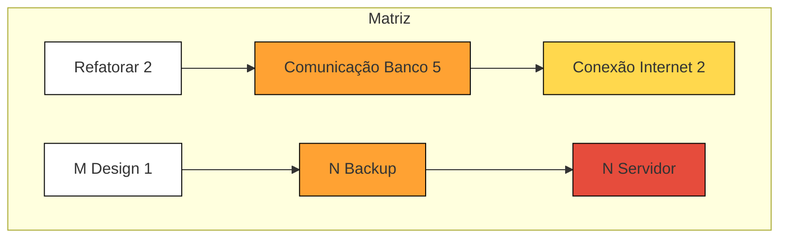

```mermaid
graph TD
subgraph Matriz

A1["Refatorar 2"]:::branco-->
A2["Comunicação Banco 5"]:::laranja-->
A3["Conexão Internet 2"]:::amarelo

B1["M Design 1"]:::branco-->
B2["N Backup"]:::laranja-->
B3["N Servidor"]:::vermelho

end

classDef branco fill:#fff, stroke:#000, stroke-width:1px;
classDef laranja fill:#FFA233, stroke:#000, stroke-width:1px;
classDef amarelo fill:#FFD84D, stroke:#000, stroke-width:1px;
classDef vermelho fill:#E64C3C, stroke:#000, stroke-width:1px;  


```
