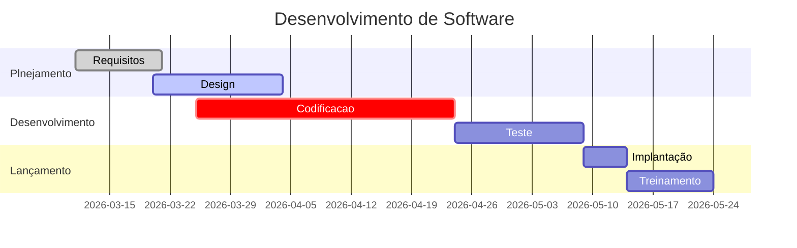

```mermaid

gantt
   %%%Definir título principal
   title Desenvolvimento de Software

   %%%Definir o formato data (Ano-Mês-Dia)
   dateFormat YYYY-MM-DD

   %%%Criação do agrupamento visual para as tarefas iniciais
   section Plnejamento

   %%%'done': Tarefa concluida(fica cinza). 'req' é o ID da tarefa - 2026-03-11 'data de inicio' - 10d - 'duracao'
   Requisitos :done, req, 2026-03-11, 10d

   %%%'active' Tarefa em andamento
   Design :active, des, 2026-03-20, 15d

   %%%Criação do segundo bloco
   section Desenvolvimento

   %%%'crit' Define como tarefa crítica (cor vermelha ou destaque)
   Codificacao :crit, dev, 2026-03-25, 30d

   %%%'after dev': Realiza a tarefa quando a tarefa dev terminar
   Teste :test, after dev, 15d

   section Lançamento
   Implantação: dep, after test, 5d
   Treinamento: tra, after dep, 10d

```
